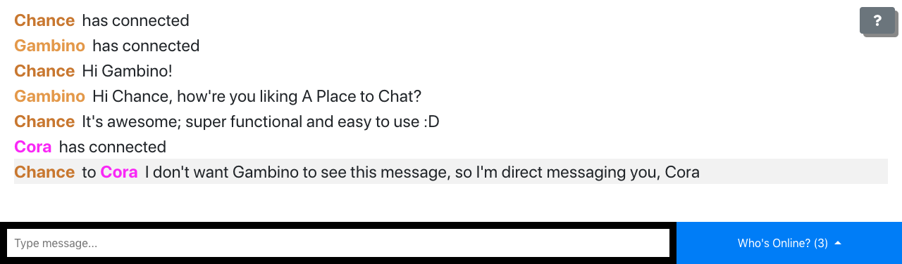

# chatroom

[Online here](https://aplacetochat.azurewebsites.net/)

This is a chatroom web app using Node and socket.io inspired by the chatroom demo from [Socket.io](https://socket.io/demos/chat/).

## Features:
* Personalized Nicknames (or a randomly assigned name if one isn't entered)
	* Random names are provided via a short list stored in the code. If you have suggestions, leave a comment in the [Suggestions](https://github.com/chanceoneal/chatroom/issues/3) issue.
* Displays which users are typing
* Displays who's online
* Direct Messaging ability

(More to come)

## Images
Type in your name, or press `ESC` for a random name.

Everyone will be notified when you're connected:

Chatting is as simple as typing and pressing enter! These are examples of global messages:

To direct message somebody, simply type out a message and select their name from the "Who's Online?" menu:

As is the case with direct messages, nobody else can see them:

